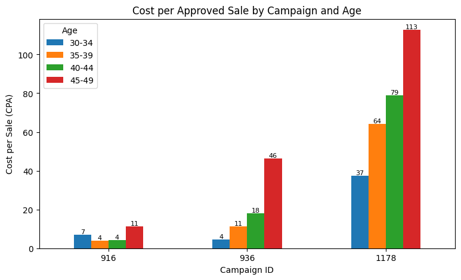
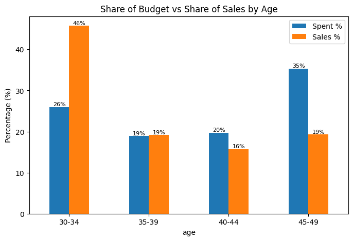

# Facebook Ads Performance Analysis

Where is the ad budget going, and which audiences are worth paying for?

## Summary
I analyzed 1,143 ads across 3 Facebook campaigns (about 58.7K total spend, currency not specified in the dataset).

- **Ages 45-49 took 35% of the budget but produced only 19% of sales.** Their cost per sale was about 3x higher than ages 30-34.
- **Ages 30-34 produced 46% of sales with 26% of the budget.**
- **25% of the budget (14,754) went to ads that got enquiries but no sales.**
- Women received 59% of the budget and produced 46% of sales.

## What I did
1. Checked data quality: no missing values, no duplicates.
2. Found logic issues: 71 ads with zero spend but sales, and 72 ads with more sales than clicks.
3. Built metrics: CTR, CPC, CPA, conversion rate.
4. Compared budget share vs sales share by age, gender and campaign.
5. Re-ran the age analysis after removing the 208 suspicious rows. The result held.

## Recommendation
Move part of the 45-49 budget (start with 20%) to ages 30-34, then re-measure CPA before scaling. Costs can rise as an audience gets saturated.

Also check why ads with enquiries are not turning into sales. That could be audience quality or the sales follow-up.

## Questions I would ask the client
- Why do some ads show sales with zero spend or more sales than clicks? (tracking issue?)
- What is the sales process after an enquiry?

## Limitations
- Public Kaggle dataset, not client data.
- Results show association, not proven cause.
- Campaign 916 is too small to draw conclusions from.
- Gender results were not re-tested after removing suspicious rows.

## Tools
Python, Pandas, Matplotlib (Google Colab)

Data: Kaggle "Clicks Conversion Tracking" (KAG_conversion_data.csv)
